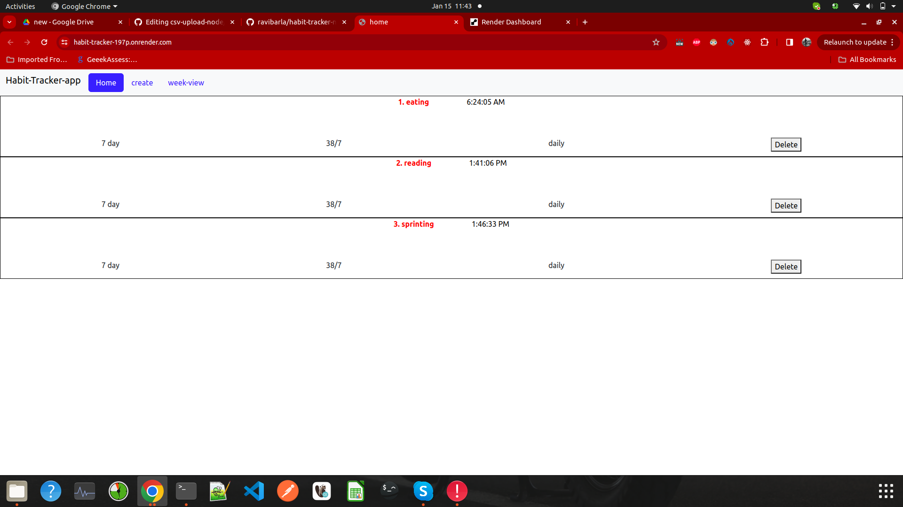

live url :- "https://habit-tracker-197p.onrender.com"

project title : "Habit-Tracker-App"

project description : This is a habit tracker app which allows to perform some CRUD operation.

features :- 

1. adding new habit
2. updating habit status
3. deleting habit
4. viewing habit overview in the home page 
5. track and update the weekly habits in the week view page

built using :-

1. node js
2. express js
3. mongodb
4. mongoose js
5. ejs template engine
6. css
7. bootstrap
   
deployment platform :-

1. [Render]

   
## Tech

Dillinger uses a number of open source projects to work properly:

1. [node-js]
2. [express-js]
3. [mongodb]
4. [mongoose-js]
5. [ejs-template-engine]
6. [css]
7. [bootstrap]

## Plugins

Instructions on how to use them in your own application are linked below.

| Plugin | README |
| ------ | ------ |
| GitHub | [plugins/github/README.md]

[//]: # (These are reference links used in the body of this note and get stripped out when the markdown processor does its job. There is no need to format nicely because it shouldn't be seen. Thanks SO - http://stackoverflow.com/questions/4823468/store-comments-in-markdown-syntax)

[HTML]:<https://developer.mozilla.org/en-US/docs/Web/HTML>
[CSS]:<https://developer.mozilla.org/en-US/docs/Learn/CSS>
[node-js]:<https://nodejs.org/en>
[express-js]:<https://expressjs.com/>
[ejs-template-engine]: <https://ejs.co/>
[bootstrap]: <https://getbootstrap.com/>
[render]: <https://dashboard.render.com/>
[mongoose-js]:<https://www.mongodb.com/>

## Screenshots
   
- Home page
   

- week View

- create

  

